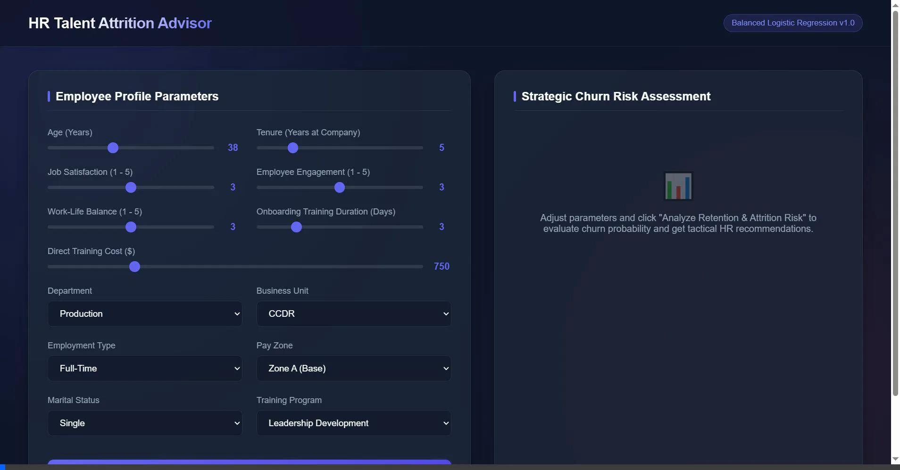
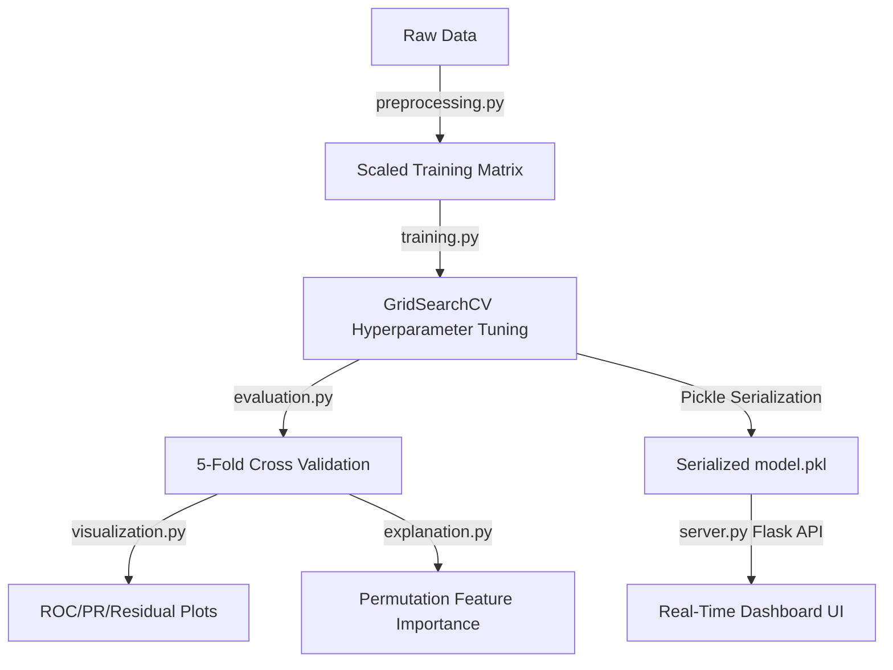

# 📊 HR Employee Performance, Engagement & Talent Attrition Analytics

An end-to-end data cleaning, exploratory data analysis (EDA), and machine learning workflow analyzing 3,000+ employee records. This repository implements predictive models for employee performance and **talent attrition (churn)**, identifies key organizational drivers, and provides a web-based **Interactive Talent Attrition Advisor UI** for HR talent optimization.

<div align="center">
  <a href="https://colab.research.google.com/github/Ali-Khamis45/orangelab1/blob/main/taskLAB1orange.ipynb" target="_parent">
    
  </a>
  
  
  
</div>

---

## 🖥️ Interactive Web Dashboard (Advisor UI)

To make the machine learning models actionable for HR managers and business leaders, we built a premium web-based **Talent Attrition Advisor Dashboard**. This single-page application connects to a Flask backend serving the pre-trained, class-balanced machine learning model.



### Key Features:
* **Interactive Profile Form:** Input employee parameters (Age, Tenure, Satisfaction, Engagement, Work-Life Balance, Training Budgets, Departments, and Business Units).
* **Live Attrition Risk Gauge:** Displays the probability of churn (0% to 100%) in a smooth, color-coded gauge ring (Green for Low Risk, Coral for High Risk).
* **Relative Contribution Bars:** Breaks down how much different features (Tenure, Age, Training, Satisfaction) contribute to the overall churn risk.
* **Dynamic HR Recommendations:** Generates immediate, personalized intervention strategies based on the prediction results (e.g. scheduling early career syncs or job satisfaction audits).
* **Downloadable PDF/JSON Reports:** Export predictions and local explanations instantly.

---

## 📂 Repository Structure

```
orangelab1/
├── src/                      # Reusable python modules
│   ├── __init__.py
│   ├── preprocessing.py      # Feature engineering and scaling
│   ├── training.py           # Model tuning (GridSearchCV) and training
│   ├── evaluation.py         # Cross-validation and metrics calculation
│   ├── visualization.py      # Production-grade plotting scripts
│   └── explanation.py        # Permutation importance and explainability
├── static/                   # Flask front-end assets
│   ├── index.html            # Enhanced interactive UI
│   ├── ui_screenshot.webp    # UI screenshot
│   └── plots/                # Static evaluation plots referenced in reports
│       ├── roc_curves.png
│       ├── pr_curves.png
│       ├── calibration.png
│       ├── residuals.png
│       ├── feature_importance.png
│       └── confusion_matrix.png
├── ml_models/                # Serialized model artifacts
│   ├── model.pkl
│   ├── scaler.pkl
│   ├── feature_columns.json
│   └── defaults.json
├── train_pipeline.py         # Executable training pipeline script
├── server.py                 # Enhanced Flask backend API
├── taskLAB1orange.ipynb      # Cleaned notebook importing from src/
├── ml_methodology_report.md  # Rewritten methodology report
├── ml_performance_report.md  # Rewritten performance report
├── ml_attrition_report.md    # Rewritten attrition report
├── ml_technical_report.md    # New combined technical report
└── README.md                 # Recruiter-friendly README
```

---

## ⚙️ System Architecture & Workflow



---

## 📊 Model Performance Benchmarking

### Attrition Prediction (Classification - Holdout Test Set)

| Model | Accuracy | ROC-AUC | Recall (Class 1) | F1-Score (Class 1) |
| :--- | :---: | :---: | :---: | :---: |
| **Tuned Logistic Regression** | 70.67% | 0.8148 | **85.71%** | 0.4286 |
| **Tuned Random Forest** | 74.00% | **0.8143** | 84.42% | **0.4545** |
| **Tuned Gradient Boosting (Deployed)** | **74.50%** | 0.8078 | 75.32% | 0.4312 |

### Performance Rating Prediction (Regression - 5-Fold Cross Validation)

| Model | CV RMSE (Mean) | CV R² (Mean) | CV MAE (Mean) |
| :--- | :---: | :---: | :---: |
| **Decision Tree** | 1.4357 ± 0.0203 | -1.0393 ± 0.0976 | 1.0792 ± 0.0207 |
| **Random Forest** | 1.0288 ± 0.0226 | -0.0458 ± 0.0132 | 0.7515 ± 0.0219 |
| **Gradient Boosting (Best)** | **1.0269 ± 0.0215** | **-0.0419 ± 0.0135** | **0.7432 ± 0.0189** |

---

## ⚙️ Installation & Local Setup

### 1. Clone the repository:
```bash
git clone https://github.com/Ali-Khamis45/orangelab1.git
cd orangelab1
```

### 2. Install dependencies:
```bash
pip install pandas numpy scikit-learn matplotlib seaborn flask jupyter
```

### 3. Run the model training pipeline:
```bash
python train_pipeline.py
```
This script runs cross-validation benchmarking, searches hyperparameter grids, saves evaluation plots to `static/plots/`, and serializes the champion model to `ml_models/`.

### 4. Launch the dashboard server:
```bash
python server.py
```
Open your browser and navigate to: [http://127.0.0.1:5000/](http://127.0.0.1:5000/)
