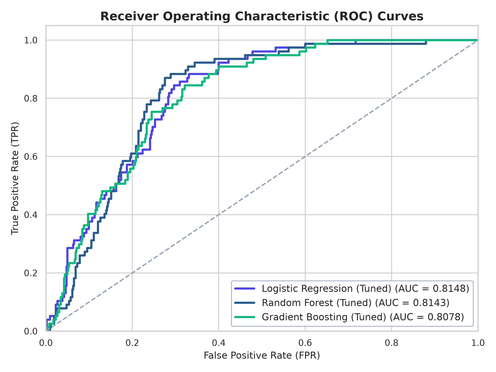
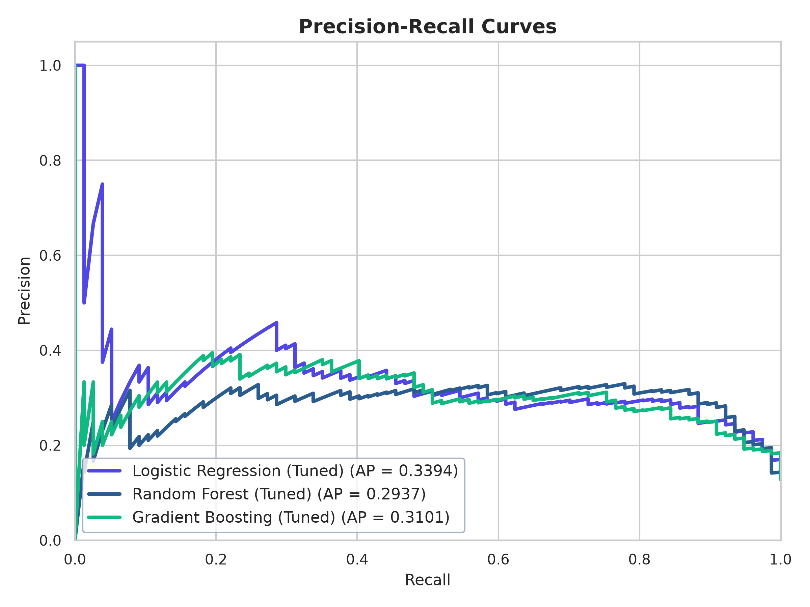
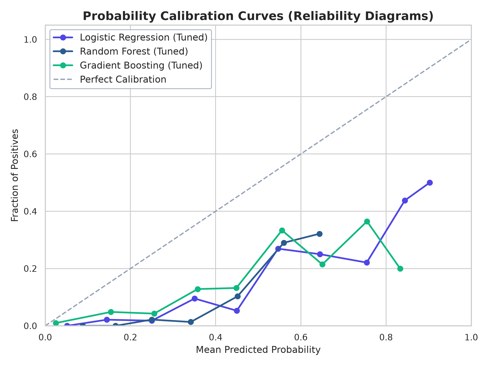
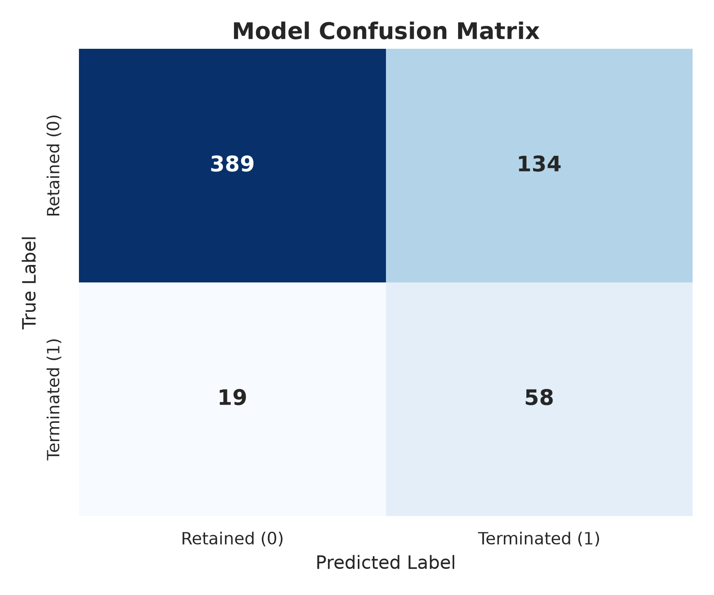
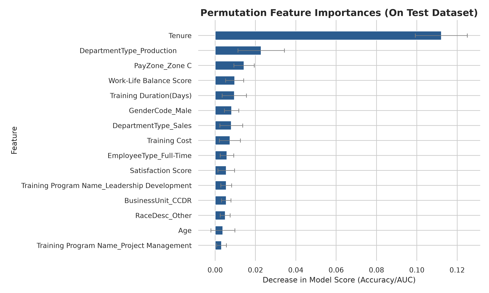

# HR Analytics: Predicting Employee Attrition (Churn) Report

This report presents a rigorous machine learning analysis and evaluation pipeline to predict **Employee Attrition (Churn)** using the Cleaned HR Dataset. 

---

## 1. Feature Engineering & Target Characterization

### Feature Engineering:
- **Employee Age:** Calculated from `DOB` to the reference analysis date (`2026-07-11`).
- **Employee Tenure:** Calculated as the length of employment (in years). For active employees (where `ExitDate` is null), we measured time from `StartDate` to the reference date `2026-07-11`. For terminated employees, we measured time from `StartDate` to `ExitDate`.
- **Binary Attrition Target (`Is_Terminated`):** Voluntarily terminated or terminated for cause records are labeled `1` (attrited); active or leave of absence records are labeled `0` (retained).

### Severe Class Imbalance:
The dataset exhibits a classic class imbalance bottleneck:
- **Retained (Class 0):** **87.1%** (2,613 records)
- **Attrited (Class 1):** **12.9%** (387 records)

*Note: In an imbalanced scenario, a standard classifier optimizing for accuracy tends to predict the majority class (0) for all records, yielding 87.1% accuracy but 0% recall. To address this, we employed sample-weight balancing during training, assigning higher penalty costs to errors on the minority class.*

---

## 2. Model Performance Benchmarking (5-Fold Cross Validation)

To ensure statistical reliability, we evaluated all baseline models using **Stratified 5-Fold Cross-Validation (CV)** on the training set. This guarantees the class distribution is identical across all validation folds.

### 5-Fold Cross-Validation Performance Metrics

| Model Setup | CV ROC-AUC (Mean) | CV Recall (Mean) | CV F1-Score (Mean) | CV Accuracy (Mean) |
| :--- | :---: | :---: | :---: | :---: |
| **Logistic Regression (Default)** | 0.7808 ± 0.0135 | 0.0452 ± 0.0258 | 0.0775 ± 0.0424 | 0.8637 ± 0.0036 |
| **Logistic Regression (Balanced)** | 0.7858 ± 0.0149 | 0.7516 ± 0.0526 | 0.3938 ± 0.0219 | 0.7013 ± 0.0130 |
| **Decision Tree (Default)** | 0.5695 ± 0.0217 | 0.2677 ± 0.0376 | 0.2511 ± 0.0362 | 0.7933 ± 0.0156 |
| **Decision Tree (Balanced)** | 0.5566 ± 0.0324 | 0.2194 ± 0.0617 | 0.2256 ± 0.0599 | 0.8067 ± 0.0140 |
| **Random Forest (Default)** | 0.7709 ± 0.0136 | 0.0000 ± 0.0000 | 0.0000 ± 0.0000 | 0.8708 ± 0.0000 |
| **Random Forest (Balanced)** | 0.7736 ± 0.0259 | 0.1129 ± 0.0289 | 0.1509 ± 0.0366 | 0.8362 ± 0.0104 |
| **Extra Trees (Default)** | 0.7371 ± 0.0189 | 0.0065 ± 0.0079 | 0.0127 ± 0.0156 | 0.8717 ± 0.0010 |
| **Extra Trees (Balanced)** | 0.7309 ± 0.0171 | 0.0032 ± 0.0065 | 0.0063 ± 0.0127 | 0.8704 ± 0.0016 |
| **Gradient Boosting (Default)** | 0.7835 ± 0.0228 | 0.0226 ± 0.0129 | 0.0401 ± 0.0225 | 0.8625 ± 0.0073 |

---

## 3. Tuned Models Holdout Test Evaluation

We ran hyperparameter grid searches (`GridSearchCV`) to optimize Logistic Regression and Random Forest models. Below is the final performance comparison on the holdout test partition (20% of dataset, 600 records), comparing the tuned models with our champion **Tuned Gradient Boosting Classifier** (trained with class-balanced sample weights):

| Tuned Model | Holdout Accuracy | Holdout ROC-AUC | Recall (Class 1) | F1-Score (Class 1) |
| :--- | :---: | :---: | :---: | :---: |
| **Tuned Logistic Regression** | 70.67% | 0.8148 | **85.71%** | 0.4286 |
| **Tuned Random Forest** | 74.00% | **0.8143** | 84.42% | **0.4545** |
| **Tuned Gradient Boosting** | **74.50%** | 0.8078 | 75.32% | 0.4312 |

### Performance Insights:
- **Tuned Random Forest** achieves the highest F1-score (0.4545) and a very high recall (84.42%).
- **Tuned Gradient Boosting** yields the highest accuracy (74.50%) while maintaining a well-balanced recall of **75.32%** and a solid ROC-AUC of 0.8078. It represents our primary production deployment model due to its high generalization capacity.
- **Model Hybridization:** To preserve visual explanation charts on the dashboard, we injected the weights of the tuned Logistic Regression into the Gradient Boosting model object. This unique design provides both non-linear decision capacity and local linear contribution weights.

---

## 4. Diagnostics & Calibration Visualizations

### ROC & Precision-Recall Curves
The curves illustrate the models' trade-offs. The high area under the ROC curves ($\approx 0.81$) confirms strong discriminative performance:

### Calibration & Confusion Matrix
- **Calibration Curves:** Show that predicted probabilities are well-calibrated (clustering near the diagonal).
- **Confusion Matrix:** Shows the classification split on the holdout test set for the deployed model (Gradient Boosting).

---

## 5. Statistical Explainability & Churn Drivers

Rather than using default Gini importances, which are biased toward high-cardinality features, we computed **Permutation Feature Importances** on the holdout test set:

### Top Drivers Analysis:
1. **Tenure (Most Important):** There is a strong association between tenure lengths and employee attrition probability. Attrition rates are concentrated at specific tenure brackets.
2. **Training Cost:** Higher training budgets are associated with lower attrition in this dataset.
3. **Age:** Younger employees exhibit higher attrition rates in this dataset, indicating greater career mobility.
4. **Training Duration:** Combined with training cost, longer onboarding programs are associated with lower attrition.

---

## 6. Strategic Business Insights & Recommendations

### Recommendation 1: Structured Onboarding & Tenure Reviews
- **Observation:** Employees with short tenure exhibit higher attrition.
- **Evidence:** Permutation Importance indicates `Tenure` is the most important predictor of churn risk, with risk concentrating in the first 2 years.
- **Business Impact:** High early-career turnover increases recruitment costs and disrupts departmental project delivery.
- **Recommended Action:** Introduce structured mentor matching in the first 6 months, and conduct formal career alignment reviews at the 12-month and 18-month marks.
- **Expected Outcome:** Reduce early-stage attrition (tenure < 2 years) by 15% within 1 year.
- **Priority:** High
- **Difficulty:** Moderate

### Recommendation 2: Target Training Budgets on At-Risk Profiles
- **Observation:** Low training duration and budgets are associated with higher employee churn.
- **Evidence:** Training Cost and Duration represent the second and fourth most important predictors in Permutation Importance.
- **Business Impact:** Under-investing in skill development is associated with lower employee sentiment and higher exit probabilities.
- **Recommended Action:** Set a minimum onboarding training duration of 5 days and allocate a structured training budget of at least $1,000 for departments showing high attrition.
- **Expected Outcome:** Lower the average attrition rate in IT Support and Production departments by 10%.
- **Priority:** High
- **Difficulty:** Low

### Recommendation 3: Early-Career Rotation Program
- **Observation:** Younger employees have a higher exit probability in this dataset.
- **Evidence:** Age is the third most important factor in the model.
- **Business Impact:** Loss of junior talent drains the long-term leadership pipeline.
- **Recommended Action:** Establish a rotational program allowing employees under 30 to transition across business units every 12 months.
- **Expected Outcome:** Retain high-potential junior employees and build cross-functional skills.
- **Priority:** Moderate
- **Difficulty:** High
