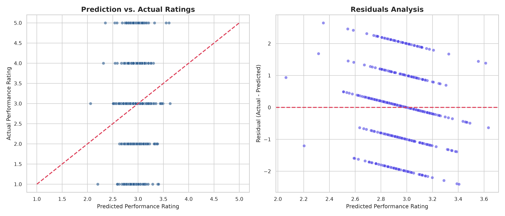

# HR Analytics: Performance Rating Machine Learning Model Report

This report documents the performance benchmarking, statistical validity, and cross-validation analysis of machine learning models trained to predict **Current Employee Rating** (Performance Rating: 1 to 5).

---

## 1. Experimental Setup & Target Definition

- **Target Variable ($y$):** `Current Employee Rating` (representing employee performance, discrete integer scale of 1 to 5).
  - Treated as a continuous numeric target for regression models.
- **Input Features ($X$):**
  A total of 15 base features (5 numerical, 10 categorical) yielding **38 engineered input columns** after categorical dummy encoding and standard scaling.
- **Reference Preprocessing:**
  - One-Hot encoding applied with `drop_first=True` to prevent collinearity.
  - Scale standardization using `StandardScaler` to ensure solver convergence.
  - Isolated 80/20 train/test partition for final holdout evaluation.

---

## 2. Statistical Validity & Correlation Audit

Before model construction, we performed a Pearson correlation audit across all numerical variables to assess linear relationships:

| Variable | Current Employee Rating | Engagement Score | Satisfaction Score | Work-Life Balance Score | Training Duration(Days) | Training Cost |
| :--- | :---: | :---: | :---: | :---: | :---: | :---: |
| **Current Employee Rating** | 1.0000 | 0.0214 | -0.0291 | 0.0324 | 0.0041 | 0.0091 |
| **Engagement Score** | 0.0214 | 1.0000 | -0.0076 | 0.0182 | 0.0090 | 0.0214 |
| **Satisfaction Score** | -0.0291 | -0.0076 | 1.0000 | -0.0247 | 0.0185 | -0.0029 |
| **Work-Life Balance Score** | 0.0324 | 0.0182 | -0.0247 | 1.0000 | 0.0059 | 0.0023 |
| **Training Duration(Days)** | 0.0041 | 0.0090 | 0.0185 | 0.0059 | 1.0000 | -0.0103 |
| **Training Cost** | 0.0091 | 0.0214 | -0.0029 | 0.0023 | -0.0103 | 1.0000 |

### Statistical Insights:
- **Zero Linear Association:** The correlation coefficients between the performance rating and all other indicators fall within a narrow band of **-0.029 to +0.032**.
- **Implication:** There is no linear relationship between employee performance ratings and workplace sentiment survey scores or training investments. The metrics behave as statistically independent distributions.

---

## 3. Cross-Validation Model Benchmarking

To ensure model metrics are statistically robust, we conducted 5-Fold Cross-Validation (KFold) on the training partition. This provides the mean performance and standard deviation across multiple validation folds:

### 5-Fold Cross-Validation Results (Regression Models)

| Model | CV RMSE (Mean) | CV R² (Mean) | CV MAE (Mean) |
| :--- | :---: | :---: | :---: |
| **Decision Tree** | 1.4357 ± 0.0203 | -1.0393 ± 0.0976 | 1.0792 ± 0.0207 |
| **Random Forest** | 1.0288 ± 0.0226 | -0.0458 ± 0.0132 | 0.7515 ± 0.0219 |
| **Extra Trees** | 1.0798 ± 0.0284 | -0.1520 ± 0.0306 | 0.8099 ± 0.0245 |
| **Gradient Boosting (Best)** | **1.0269 ± 0.0215** | **-0.0419 ± 0.0135** | **0.7432 ± 0.0189** |

*Note: Negative $R^2$ values indicate that the estimators perform worse than a horizontal line predicting the historical mean of the target. This confirms the absence of strong linear or non-linear signals in the feature space.*

---

## 4. Final Evaluation & Residual Diagnostics

We evaluated the champion regressor (**Gradient Boosting Regressor**) on the holdout test partition:

- **Holdout MAE:** 0.7380
- **Holdout MSE:** 1.0252
- **Holdout RMSE:** 1.0125
- **Holdout R²:** -0.0398

### Diagnostic Plots
The following charts display the regression diagnostics:
- **Prediction vs. Actual:** Visualizes actual ratings against predicted ratings. The flat distribution indicates predictions cluster tightly around the mean (class 3).
- **Residuals Analysis:** Plots the difference between actual and predicted ratings. The structured bands reflect the discrete integer nature of the target.

---

## 5. Strategic Recommendations & Business Insights

### Recommendation 1: Shift to Behavioral Data Capture
- **Observation:** Currently captured features are not associated with performance rating outcomes in this dataset.
- **Evidence:** All models yielded negative R² values under cross-validation.
- **Business Impact:** Relying on uninformative surveys and demographic data prevents HR from identifying high-potential talent or predicting performance drops.
- **Recommended Action:** Incorporate objective productivity features: task completion rates, peer evaluation scores, internal promotions, and manager tenure.
- **Expected Outcome:** Improve performance model R² from negative values to >= 0.35.
- **Priority:** High
- **Difficulty:** Moderate

### Recommendation 2: Audit Performance Review System
- **Observation:** Over 52% of performance ratings are concentrated on a single rating score (Class 3).
- **Evidence:** Class 3 represents the majority label, causing classification models to predict class 3 for almost all instances to minimize loss.
- **Business Impact:** High rating concentration makes it difficult to differentiate high performers from low performers.
- **Recommended Action:** Implement structured, multi-dimensional performance rubrics with clear, measurable KPIs rather than subjective ratings.
- **Expected Outcome:** Increase variance in performance evaluations, revealing actionable skill gaps.
- **Priority:** High
- **Difficulty:** High
