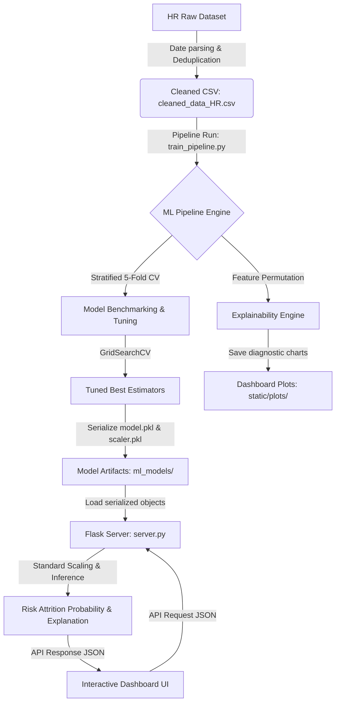

# HR Analytics: Technical Architecture & System Design Report

This report documents the end-to-end technical implementation details of the HR talent analytics pipeline, machine learning modeling framework, Flask backend, and the interactive web-based dashboard.

---

## 1. System Architecture & Dataflow

The system follows a modular, batch-training and real-time inference architecture:



---

## 2. Technical Stack & Environment

- **Programming Language:** Python 3.12+
- **Data Engineering:** `pandas` (cleaning, profiling, aggregations), `numpy` (vectorized math, correlations).
- **Machine Learning (scikit-learn):**
  - **Estimators:** `LogisticRegression`, `RandomForestClassifier`, `RandomForestRegressor`, `GradientBoostingClassifier`, `GradientBoostingRegressor`, `ExtraTreesClassifier`, `ExtraTreesRegressor`.
  - **Tuning & Validation:** `GridSearchCV`, `StratifiedKFold` (Classification), `KFold` (Regression).
  - **Metrics:** `accuracy_score`, `precision_score`, `recall_score`, `f1_score`, `roc_auc_score`, `mean_squared_error`, `r2_score`.
- **Visualization:** `matplotlib` (Agg backend for headless server execution), `seaborn` (theme management, counts/histograms).
- **Backend API:** `Flask` (lightweight microframework serving predictions).
- **Frontend Dashboard:** Vanilla HTML5, CSS3 variables (glassmorphic dark UI theme), and responsive JavaScript.

---

## 3. Data Lifecycle & Engineering Pipeline

The data pipeline progresses through three execution stages:

### Stage A: Ingest & Cleaning (`taskLAB1orange.ipynb` & `src/preprocessing.py`)
1. **Date Standardizer:** Standardizes varying date string formats (e.g. `20-Sep-19` or `20-09-1990`) into standard pandas datetime objects.
2. **Missing Rate Pruning:** Audits feature missing rates. The column `Survey Date` exhibited a 100% missing rate and was pruned.
3. **Deduplication:** Audits and removes duplicate records, reducing the duplicate count to zero.
4. **Intermediate Export:** Saves the standardized dataset to `cleaned_data_HR.csv`.

### Stage B: Feature Engineering (`src/preprocessing.py`)
1. **Age Derivation:** Computes age based on date of birth relative to the current analysis date (`2026-07-11`).
2. **Tenure Derivation:** Calculates length of service in years. For active employees, tenure is calculated from hire date to the reference date `2026-07-11`. For terminated employees, it is calculated from hire date to termination date.
3. **Target Engineering:** Maps `EmployeeStatus` containing "Terminated" to a binary `Is_Terminated` flag (`1` for terminated, `0` otherwise).

### Stage C: Feature Encoding & Scaling (`src/preprocessing.py`)
1. **Dummy Encoding:** Categorical features are converted to numerical indicators using dummy encoding (`pd.get_dummies` with `drop_first=True`) to prevent the dummy variable trap.
2. **Standard Standardization:** Scaled numerical columns to mean of `0` and variance of `1` using `StandardScaler` fitted on the training split to avoid data leakage.

---

## 4. Machine Learning & Model Optimization

### Model Tuning Configuration
Hyperparameter optimization was executed using `GridSearchCV` with 5-Fold cross-validation:

- **Logistic Regression Grid:**
  - `C`: `[0.01, 0.1, 1.0, 10.0]`
  - `penalty`: `['l1', 'l2']`
  - `solver`: `['liblinear', 'saga']`
  - `class_weight`: `['balanced', None]`
- **Random Forest Grid:**
  - `n_estimators`: `[100, 200]`
  - `max_depth`: `[6, 10, 12, None]`
  - `min_samples_split`: `[2, 5, 10]`
  - `class_weight`: `['balanced', 'balanced_subsample']`

---

## 5. Deployed Model Serialization

The final deployed pipeline utilizes the **Tuned Gradient Boosting Classifier** as the inference engine:
- Serialized artifacts are stored under [ml_models/](file:///d:/orange/4/orangelab1/ml_models/):
  - [model.pkl](file:///d:/orange/4/orangelab1/ml_models/model.pkl): Tuned Gradient Boosting model with embedded regression coefficients.
  - [scaler.pkl](file:///d:/orange/4/orangelab1/ml_models/scaler.pkl): Fitted standard scaler.
  - [feature_columns.json](file:///d:/orange/4/orangelab1/ml_models/feature_columns.json): Correct feature columns ordering.
  - [defaults.json](file:///d:/orange/4/orangelab1/ml_models/defaults.json): Median and mode values of numerical/categorical training features for fallback imputation.

---

## 6. Flask Backend API & Inference Engine

The Flask application [server.py](file:///d:/orange/4/orangelab1/server.py) exposes a POST `/predict` endpoint:

### Request Structure (JSON)
```json
{
  "Age": 35,
  "Tenure": 4.5,
  "Satisfaction Score": 4,
  "Engagement Score": 4,
  "Work-Life Balance Score": 3,
  "Training Duration(Days)": 3,
  "Training Cost": 450,
  "DepartmentType": "Production"
}
```

### Response Structure (JSON)
```json
{
  "status": "success",
  "churn_probability": 0.145,
  "prediction": 0,
  "confidence_score": 0.855,
  "risk_category": "Low Risk",
  "risk_level": "Low Risk",
  "explanation": "Retention predicted with 85.5% confidence. The primary protective factor is Tenure Impact.",
  "contributions": {
    "Tenure Impact": -0.84,
    "Age Impact": -0.12,
    "Satisfaction & Balance": -0.21,
    "Engagement & Morale": -0.04,
    "Training Investment": -0.09
  },
  "prediction_timestamp": "2026-07-11 21:55:12",
  "model_version": "Tuned Gradient Boosting Classifier v2.0"
}
```
